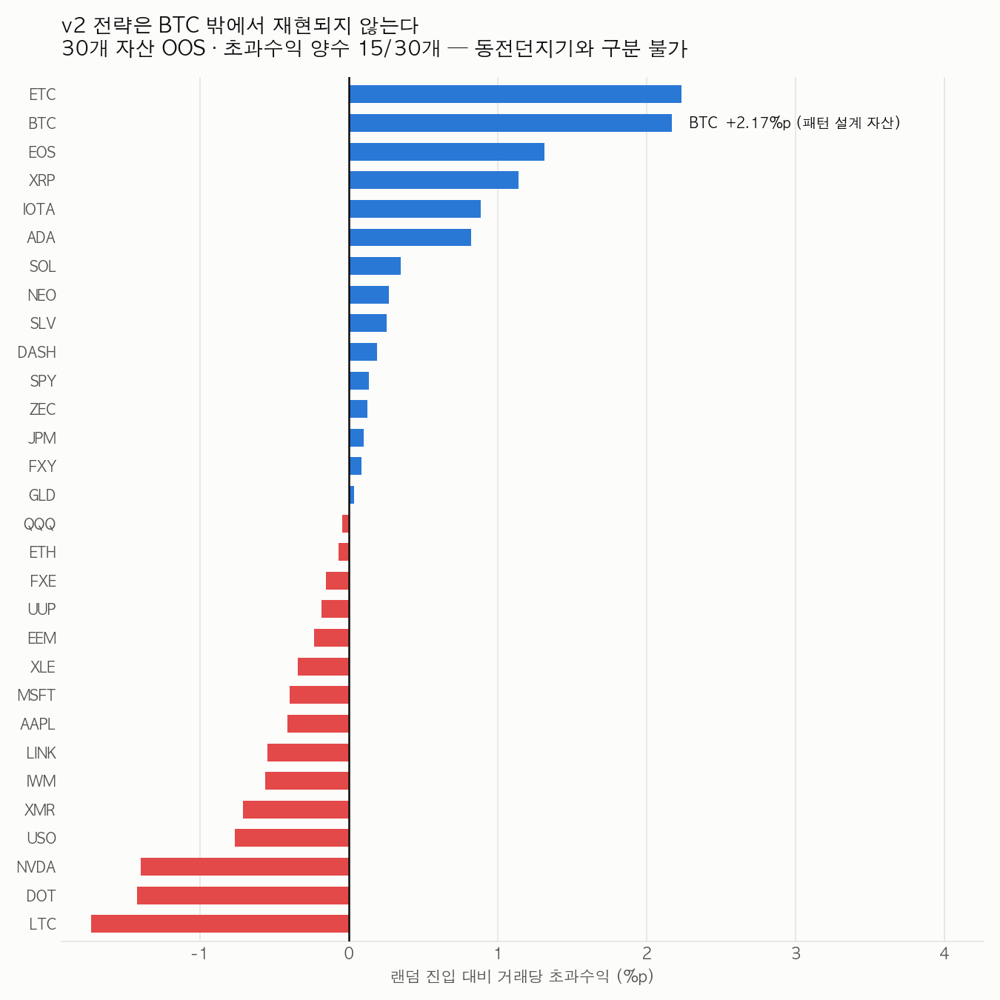

# NCP — New Candlestick Pattern

비트코인 1일봉 데이터를 기반으로 **범용 캔들패턴**을 발굴하고 최적의 매매 전략을 개발하는 프로젝트입니다.  
과적합 방지를 핵심 원칙으로, 다양한 자산에 적용 가능한 패턴 탐지 및 백테스트 시스템을 구축합니다.

---

## 세션 구조

| 세션 | 역할 |
|------|------|
| **NCP1** | 주도 분석 및 코드 작성, 전략 제안 |
| **NCP2** | 검토·반론·대안 제시, 과적합 경고 |
| **NCP3** | 회의록 작성, 논리 일관성 검증, 최종 정리 |

> NCP1·NCP2·NCP3는 각각 독립적인 Claude Code(cccp) 세션으로 운영되며 실시간으로 협업합니다.

---

## 데이터

| 항목 | 내용 |
|------|------|
| 파일 | `BITFINEX_BTCUSD, 1D.csv` |
| 출처 | Bitfinex BTCUSD 1일봉 |
| 기간 | 2013-03-31 ~ 2026-05-24 |
| 행 수 | 4,796일 |
| 컬럼 | time (Unix), open, high, low, close, volume |

---

## 프로젝트 구조

```
NCP/
├── README.md
├── BITFINEX_BTCUSD, 1D.csv   # 원본 데이터
├── docs/
│   ├── PROJECT_PLAN.md        # 전체 계획서
│   ├── MEETING_LOG.md         # 회의록 (NCP3 작성)
│   └── VALIDATION_REPORT.md   # 최종 검증 보고서 (작성 예정)
├── src/
│   ├── eda.py                 # 탐색적 데이터 분석
│   ├── patterns.py            # 캔들패턴 정의 및 탐지
│   ├── strategy.py            # 매매 전략 로직
│   └── backtest.py            # 백테스트 엔진
└── results/                   # 백테스트 결과 (차트, CSV)
```

---

## 개발 단계 (Phase)

| 단계 | 내용 | 상태 |
|------|------|------|
| Phase 1 | 탐색적 데이터 분석 (EDA) | ✅ 완료 |
| Phase 2 | 캔들패턴 후보 발굴 | ✅ 완료 |
| Phase 3 | 전략 설계 | ✅ 완료 |
| Phase 4 | 백테스트 | ✅ 완료 |
| Phase 5 | 검증 및 최종 보고 | ⚠️ 완료 후 **철회** |
| Phase 6 | 다중자산 범용성 검증 | ✅ 완료 — **v2 기각** |
| Phase 7 | 패널 기반 신규 패턴 탐색 (조건 2개) | ✅ 완료 — **합격 0건** |
| Phase 8 | 탐색 공간 확대 (조건 3개) 및 검정력 규명 | ✅ 완료 — **합격 0건, 병목은 검정력** |

> **현재 상태 (2026-08-02):** 확정 전략 없음.
> - 확정 패턴 4종은 30개 자산 검증에서 전부 기각 (FDR 5% 생존 0건)
> - 신규 후보 **316만 개** 전수 탐색에서 Bonferroni 통과 0건
> - 경험적 귀무 대조 4회에서 신호 실재 여부는 **판정 보류** — 최소 p 기준으로는 근거 없고
>   (귀무 4회 중 3회가 실제보다 낮은 최소 p), 분포 중앙값 기준으로는 약하게 지지됨
> - 확정된 것: **자산상관 보정은 보수적이다** (귀무 p 중앙이 0.5가 아니라 0.39~0.61)
> - 어느 쪽이든 관측된 edge는 **이 설계로 인증하기엔 3~5배 작고, 거래비용 차감 후 단순 보유를 못 이긴다**
>
> 상세는 [회의 #010](docs/MEETING_LOG.md), [회의 #011](docs/MEETING_LOG.md) 참조.

---

## 핵심 원칙

### 자체 창안 원칙 (최우선)
> 기존에 알려진 캔들패턴(도지, 해머, 엔걸핑 등)은 사용하지 않습니다.  
> NCP1·NCP2·NCP3가 데이터 특성에서 출발해 **독자적으로 패턴을 창안**합니다.

### 과적합 방지 원칙
1. **가격 비율/형태 기반 패턴** — 절대 가격 수준 사용 금지
2. **파라미터 최소화** — 조정 변수 3개 이하
3. **시장 보편성 검토** — NCP2가 다른 자산에서의 유효성 반론
4. **학습/검증 기간 분리** — 학습(2013~2020) / 검증(2021~2026)
5. **Walk-forward 테스트** — 롤링 윈도우로 시간적 일반화 확인

---

## 성과 지표 목표

| 지표 | 목표 |
|------|------|
| Sharpe Ratio | > 1.0 |
| Max Drawdown | < 30% |
| Win Rate | > 50% |
| Profit Factor | > 1.5 |
| IS/OOS 성과 괴리 | < 20% |

---

## EDA 주요 발견 (Phase 1)

| 지표 | 값 |
|------|-----|
| 일 수익률 평균 | +0.222% |
| 일 수익률 표준편차 | 4.043% |
| 첨도 (Kurtosis) | 17.23 (fat-tail) |
| 상승일 비율 | 52.1% |
| 평균 몸통 비율 | 43.2% |
| 데이터 갭 | 1건 (2016-08-10, 8일, Bitfinex 해킹) |

**시장 국면 분포 (MA50 + 변동성 기준)**

| 국면 | 일수 | 평균수익률 | 승률 |
|------|------|-----------|------|
| Bull | 1,402 | +0.549% | 58.1% |
| Volatile_Bull | 1,233 | +0.970% | 58.7% |
| Bear | 986 | -0.416% | 42.2% |
| Volatile_Bear | 1,126 | -0.489% | 45.7% |

---

## 백테스트 결과 (Phase 4)

### 최종 패턴 후보 (4종 → 2종 확정)

| 패턴 | 결정 | 근거 |
|------|------|------|
| ElasticConvergence | ❌ 폐기 | Long/Short 모두 손실 |
| VolatilityFault | ❌ 폐기 | 파라미터 자유도 과다 |
| DualPressure (초안) | ❌ 폐기 | OOS PF 0.88, 과적합 |
| **TailEcho** | ✅ 채택 | OOS Sharpe 2.67, PF 1.94 |
| **BearAbsorption** | ✅ 채택 | DualPressure 재설계, OOS Sharpe 2.07, PF 1.64 |

### 최종 전략 v2: TailEcho + BearAbsorption + TripleRise (Long only, trailing stop 10%)

**BTC OOS (2021~2026)** — 2026-08-02 전면 정정, 아래 "정정 이력" 참조

| 회계 방식 | CAGR | Sharpe | MDD |
|----------|------|--------|-----|
| 기존 문서 기재 | +79.6% | 2.42 | -37.0% |
| 코드가 실제로 내는 값 | +69.0% | 1.37 | -33.3% |
| **자본 1구좌 제약 · 일별 시간축 (실현 가능한 값)** | **+10.6%** | **0.98** | **-38.5%** |
| **같은 구간 BTC 단순 보유** | **+19.4%** | — | — |

> ⚠️ **v2는 설계 대상인 BTC에서조차 그냥 BTC를 들고 있는 것보다 못하다.**
> 기존의 "연복리 +79.6% = 세계 최고 수준" 결론은 성립하지 않는다.

### v3/v4 탐색 결과 (2026-05-25)

| 후보 패턴 | 결정 | 근거 |
|---------|------|------|
| LowerTailBreak | ❌ 기각 | v2 파라미터 OOS PF 1.20, Sharpe 0.78 |
| CloseDominanceLoose | ❌ 기각 | v2 파라미터 OOS PF 1.45 (기준 1.5 미달) |
| CloseDominance (strict) | ❌ **기각** | 보류 → 2026-08-02 다중자산 검증에서 최종 부결 |

---

## 다중자산 범용성 검증 (2026-08-02) — 과적합 방지 원칙 4-2-3

프로젝트 시작 이래 한 번도 실제로 검정되지 않았던 "시장 보편성" 원칙을 30개 자산으로 검정했다.

| 항목 | 내용 |
|------|------|
| 자산 | 30종 — 암호화폐 15, 주식·ETF 9, 원자재·통화 6 |
| 백테스트 | v2와 동일 규칙 (BTC 267건 전부 오차 0으로 동치 확인) |
| 판정 기준 | 랜덤 진입 대비 초과수익(edge) — 절대 PF 아님 |

**Long only 전략은 자산이 오르기만 하면 아무 날에나 진입해도 PF > 1이 나온다.** 따라서 같은 구간·같은 청산규칙으로 무작위 진입한 분포와 비교해야 패턴 고유의 기여가 분리된다.

### 결과 — 확정 패턴 4종 전부 불합격

**BTC 제외 29개 자산, OOS**

| 전략 | 자산 | PF 중앙 | Sharpe 중앙 | edge>0 | FDR 생존 | **단순보유 압도** | CAGR 중앙 |
|------|-----|--------|-----------|--------|---------|----------------|----------|
| TailEcho | 29 | 0.98 | -0.02 | 55% | 0건 | 28% | -2.7% |
| BearAbsorption | 28 | 0.65 | -0.29 | 36% | 0건 | 32% | -2.5% |
| TripleRise | 25 | 0.78 | -0.20 | 36% | 0건 | 32% | -2.5% |
| CloseDominance | 29 | 0.80 | -0.16 | 45% | 0건 | 24% | -1.5% |
| **v2 조합** | **29** | **0.90** | **-0.14** | **48%** | **0건** | **17%** | **-4.9%** |

> - **174개 검정 전체에서 Benjamini-Hochberg FDR 5% 생존 0건.**
> - edge>0 이항검정: v2 조합 14/29 (p=0.644) — 동전던지기.
> - 29개 자산 단순 보유 중앙 수익 **+73.6%** vs v2 조합 중앙 CAGR **-4.9%**.



**자산군별 (v2 조합, OOS)** — 주식군은 PF 1.13인데 edge는 **-0.34%p**. PF>1은 주식이 올랐기 때문이지 패턴 때문이 아니다.

### 정정 이력 — 기존 수치 오류 3종

**① 문서와 코드의 청산 규칙 불일치.** 문서 성과표(승률 58.4% / PF 1.83 / MDD -37.0% / 월 4.96%)는 **고정 손절 -7%** 변형의 산출값과 소수점까지 일치하는데, `strategy.py`가 v2로 구현한 것은 **트레일링 스탑 10%** 다. 신호가 같아 거래 수 101건만 일치했다.

**② Sharpe 연율화 계수 오류 (2건).**
- 문서의 2.42는 Sharpe 1.33에 **보유 3일** 계수를 적용한 값 (1.33 × √(10/3) = 2.43). 실제 보유는 10일. 회의 #009의 CloseDominance "Sharpe 3.41"도 동일 오류.
- 코드의 `sqrt(365/MAX_HOLD)` 자체도 "연 36.5건을 쉼 없이 잇는다"는 가정인데 실제 거래빈도는 연 9.5건. 실제 빈도로 보정하면 **0.98**.

**③ 실현 불가능한 복리 회계.** OOS 65개월 중 **15개월(23%)이 거래 0건**인데 `groupby`가 그 달들을 누락시킨 뒤 12개월 전부 활동한다고 가정해 연환산했다. 게다가 **거래의 39.6%가 다른 포지션 보유 중 진입**(최대 4개 동시)인데 순차 복리로 곱했다 — 자본 제약이 없어 사실상 최대 4배 레버리지를 암묵 가정.

**추가 낙관 편향 (청산 규칙).** 진입 봉을 무시해 트레일링 스탑이 진입가에 고정 앵커되고, 스탑 발동 시 스탑가 정확 체결을 가정한다(실제로는 21.8%가 갭으로 관통, 평균 -3.14%). 이를 정상화하면 BTC OOS 누적이 **370% → 184% → 122%**. 이 편향은 갭이 큰 암호화폐에 선택적으로 몰린다(crypto 17.0% / equity 0.9%).

> **목표 재설정:** "연 60~100% 복리"는 위 오류 위에 세워진 목표이므로 폐기한다. 현 시점에서 이 프로젝트는 **단순 보유를 이기는 전략을 하나도 확보하지 못했다.**

---

## 문서

- [프로젝트 계획서](docs/PROJECT_PLAN.md)
- [회의록](docs/MEETING_LOG.md)
- [검증 보고서](docs/VALIDATION_REPORT.md) ✅
